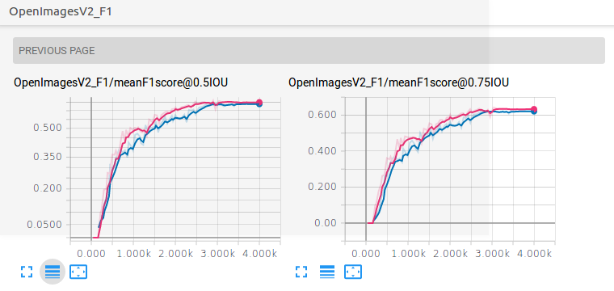

# Initial Anchor Boxes Estimation using KMeans Clusterring for Faster-RCNN

## Introduction
Faster-RCNN is one of the **state-of-the-art** object detection algorithms around.

If you are not familiar with Faster-RCNN, Please go through [this blog](https://tryolabs.com/blog/2018/01/18/faster-r-cnn-down-the-rabbit-hole-of-modern-object-detection/).

Here is the link to the original paper [ Faster R-CNN: Towards Real-Time Object Detection with Region Proposal Networks](https://arxiv.org/abs/1506.01497).

When we train Faster RCNN for custom datasets, we often get confused over how to choose hyperparameters for the Network. Anchor boxes (one of the hyperparameters) are very important to detect objects with different scales and aspect ratios. We will get improved detection results if we get the anchors right.

The training & hypereparameters are in accordance with **Tensorflow Object Detection [API](https://github.com/tensorflow/models/tree/master/research/object_detection)**.

### Faster-RCNN config file
```
faster_rcnn{
    # other hyperparameters

    first_stage_anchor_generator {
      grid_anchor_generator {
        height: 256
        width: 256
        height_stride: 16
        width_stride: 16
        scales: 0.9
        scales: 1.14
        scales: 1.53
        aspect_ratios: .8
        aspect_ratios: 1.15
        aspect_ratios: 2.77
      }
    }    
}
```
#### height & width
This is the size of base anchor size. (i.e. for scale 1 and aspect ratio 1, base anchor is 256 x 256)

#### height_stride & width_stride
This is basically the stride of anchor centers. Generally, we want to visit each point of the feature map (final convolutional layer) and create a set of anchors. Hence, It is the *subsampling ratio* of the network. In case of **VGG16** this ratio is 16. Different network archetectures have different subsampling ratios. User may select this stride as per the base-model or use case.

#### scales & aspect_ratios

Aspect Ratio of an anchor box is basically *width/height*. Scales are bigger is the anchor box from base box (i.e. 512 x 512 box is twice as big as 256 x 256).
```
if aspect_ratio = ar
   base_anchor = 256 x 256
   "width_b x height_b" is the dimension of an anchor box

width_b = scale * sqrt(ar) * base_anchor[0]
height_b = scale * base_anchor[1] / sqrt(ar)
```

## Analysis of bounding boxes (Training data)

1. Convert the *XML* files to a *csv* file.

    ``` xml_to_csv.py``` (modify this file as per your *XML* format)
2. Open     ```EDA_of_bbox.ipynb ```    **jupyter notebook** for analysis.

    Here, we convert the image dimension with *_compute_new_static_size()* function. Then we normalize bounding box height and width according to new image dimension. 

Then we find optimal clusters and cluster centers using **K-Means**. This is inspired from [YOLO](https://pjreddie.com/darknet/yolo/).

### Experiments
* Cluster bbox (width, height) on **eucledian** distance metric
* Cluster bbox (width, height) on **iou** metric (This is prefered as eucledian distance metric will give priority to bigger boxes and minimize their loss)
  
  Blue Line - Base Model (cards dataset)

  Pink Line - IOU Cluster Model (cards dataset)
    
    
    
* Cluster **AR** and **Scales** of bbox Separately with **eucledian** distance metric.
 
    Blue Line - Base Model (cards dataset)

    Green Line - Cluster Model (cards dataset)
  
    
    


*************** **More to be added** *****************

## References
1. [KMeans in YOLO](https://lars76.github.io/object-detection/k-means-anchor-boxes/)
2. [Cards Dataset (Reference)](https://github.com/EdjeElectronics/TensorFlow-Object-Detection-API-Tutorial-Train-Multiple-Objects-Windows-10)
3. [Advantage & Disadvantage of KMeans](http://playwidtech.blogspot.com/2013/02/k-means-clustering-advantages-and.html)
4. [Different Clusterring Algorithms](https://towardsdatascience.com/the-5-clustering-algorithms-data-scientists-need-to-know-a36d136ef68)